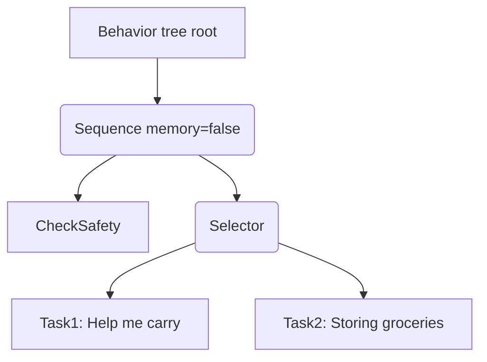
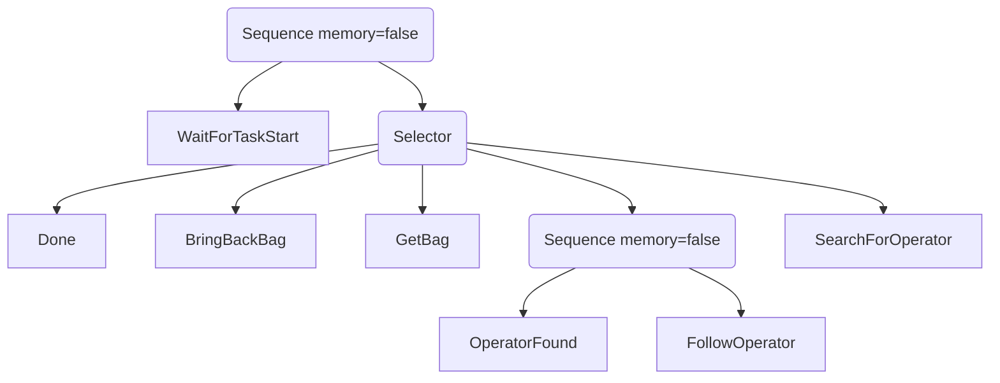
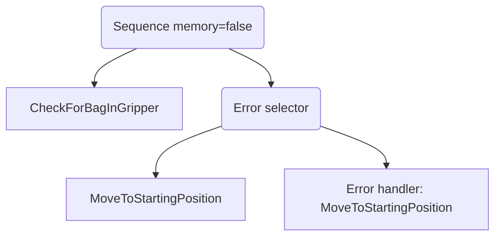
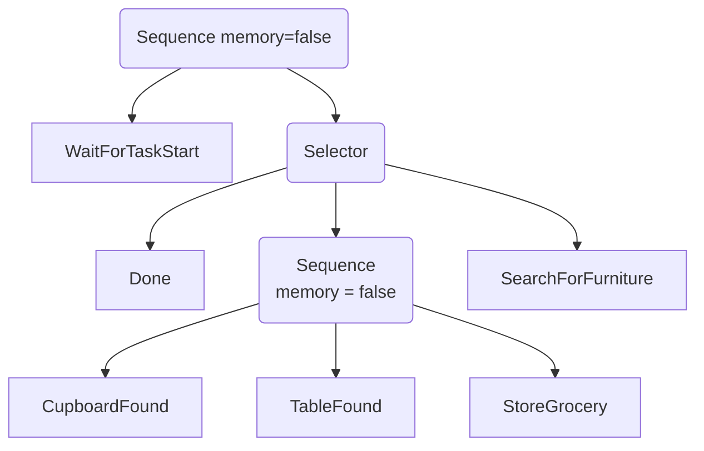
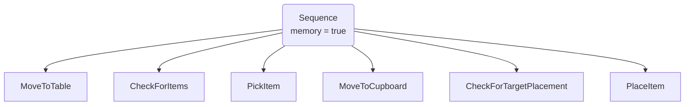
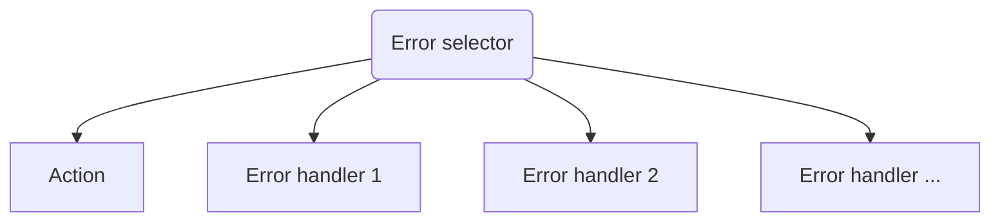

# ARLAB decision making

This package contains the global decision maker.
It contains a py_trees-based behavior tree

## Main behavior tree

## Subtree Task1

### Task1: Help me carry

### BringBackBag

## Subtree Task2

### Task2: Storing groceries

### StoreGrocery

## Error handling

Any behavior that might require special error handling can be wrapped with an **ErrorSelector**

THe *Action* in the graph below is the behavior being wrapped.

The **ErrorSelector** is a subclass of Selector with the following modifications:

- It only returns SUCCESS if the first child (Action) returns SUCCESS
- It always has memory -> Persistently stays in a running error handler
- The memory is reset if one of the error handlers returns SUCCESS -> Runs the *Action* again in the next tick
- If all children return FAILURE, it returns FAILURE as usual
