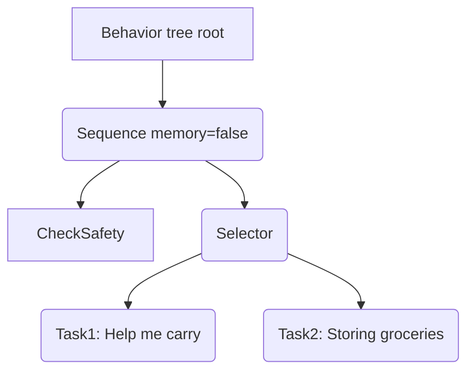
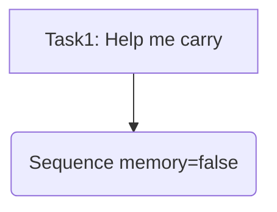

# ARLAB decision making

This package contains the global decision maker.
It contains a py_trees-based behavior tree

## Main behavior tree

```mermaid
flowchart TD
    R[Behavior tree root] --> S0(Sequence memory=false)
    S0 --> CS[CheckSafety]
    S0 --> S1(Selector)
    S1 --> T1(Task1: Help me carry)
    S1 --> T2(Task2: Storing groceries)
```

## Subtree Task1: Help me carry

```mermaid
flowchart TD
    R[Task1: Help me carry] --> S0(Sequence memory=false)
```
