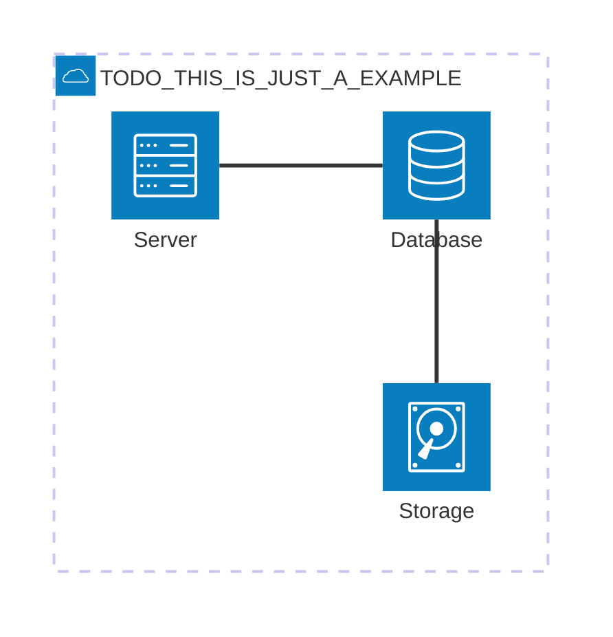

# 5. Building Block View
<!-- Static decomposition of the system, abstractions of source-code, shown as hierarchy of white boxes (containing black boxes), up to the appropriate level of detail. -->

## Whitebox Overall System

TODO: Whitebox Overview Diagram

TODO: Whitebox short motivation for the decomposition

TODO: blackbox short descriptions of the contained building blocks as table (detailed explanation of each black box happens in level 2 below)
Black Boxes

| Name | Responsibility |
| ---- | -------------- |
| TODO  | TODO           |

## TODO [Blackbox 1]

TODO: Whitebox view into each blackbox of the overall systems view at level 1

## Level 2

TODO: refine your diagrams abstraction by going further into your black box descriptions and show more details. Remove this section if not needed.
