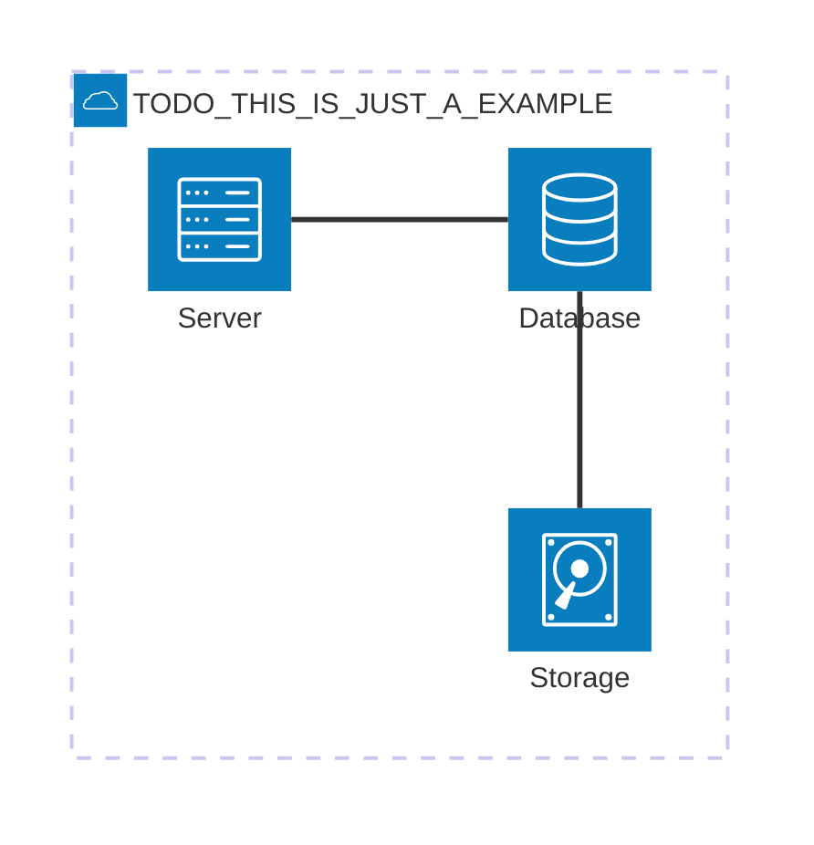

# 5. Building Block View
<!-- Static decomposition of the system, abstractions of source-code, shown as hierarchy of white boxes (containing black boxes), up to the appropriate level of detail. -->

## Whitebox Overall System

TODO: Whitebox Overview Diagram

TODO: Whitebox short motivation for the decomposition

Manipulation Blocks:

- Orchestrator
- Interface between Orchestrator and Processing
- Processing
- Acting
- Gripping Force Service
- Gazebo Sim (Ur5 & Gripper)

TODO: blackbox short descriptions of the contained building blocks as table (detailed explanation of each black box happens in level 2 below)
Black Boxes

| Name | Responsibility |
| ---- | -------------- |
| TODO  | TODO           |

Manipulation:

| Name                                          | Responsibility |
| ----                                          | -------------- |
| Orchestrator                                  | Overall coordination of manipulation |
| Interface between Orchestrator and Processing | Mediates commands and data between Orchestrator and Processing |
| Processing                                    | Calculation and planning of jobs & motions & paths |
| Acting                                        | Execution of planned movements on the robot arm and gripper  |
| Gripping Force Service                        | Determines the optimal gripping force based on object classification |
| Gazebo Simulation (UR5 & Gripper)             | Simulation of the robot for development and testing |

Movement:

- Orchestrator
- Safety (Movement)
- Nav2
- SLAM
- Leg Tracking Processor

Safety:

| Name                                          | Responsibility |
| ----                                          | -------------- |
| Globale Safety Node | This Node is a central coltrol. It is set hierarchical ontop of the local safety nodes and has the ability to freeze the system for specific safety critical situations. Over all this node scans the health states of the system modules by subscibing to the heartbeats of the local safety nodes. |
| Locale Safety Nodes | These nodes are located in the modules among the system and are adapted to scan the local tasks for safety issues. In the case of a system critical issue the local safety nodes will communicate this occurancy to the central safety node. | |

- maybe whitebox everything ecxept the safety nodes and explain what the local nodes are and what the global node is.

Knowledge base:

- Use the Signalfluss 2.0 Diagram to blackbox the DatabaseNode and the PostgreSQL database.
- Should this section focus more on the ROS nodes and dataflow between them or on the DataStructures used? -> We plan to explain the Entity, Map and RobotStatusEvent in the Runtime View with usage examples, so just mentioning that there is a DatabaseNode+Postgres should be enough in this chapter.

HRI (only planned):

- Use the Nodes from the Signalfluss 2.0 Diagram: VAD, STT, LLM chat, TTS and the LLM Server

Decision Maker:

- Just one central node containing a behavior tree... nothing else planned yet.

Perception:

| Name                                          | Responsibility |
| ----                                          | -------------- |
| LiDAR Node (lidar_data.py) | Recieves unfiltered lidar data. Publishes lidar data as a LaserScan to the ros2 system |
|  Realsensre2 Camera Node (camera_data.py) | Recieves rgb camera data. Publishes rgb data as a ros2 Image to the ros2 system |

Computer Vision:

| Name                                          | Responsibility |
| ----                                          | -------------- |
| Object Detection Node (object_detection.py) | Recieves the RBG Image from the perception. Executes object detection using the YOLO 11 Nano network. This produces classes and segementations. At the end the data will be inserted or updated in the knowledge base. |

## TODO [Blackbox 1]

TODO: Whitebox view into each blackbox of the overall systems view at level 1

## Level 2

TODO: refine your diagrams abstraction by going further into your black box descriptions and show more details. Remove this section if not needed.
