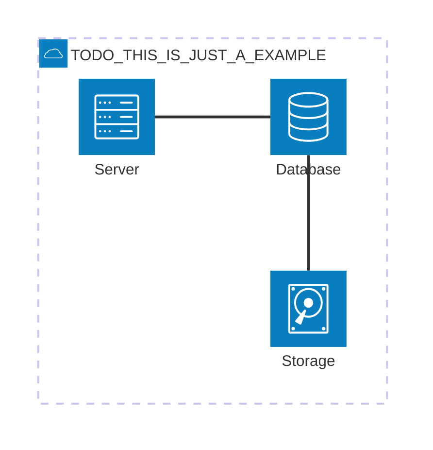

# 5. Building Block View
<!-- Static decomposition of the system, abstractions of source-code, shown as hierarchy of white boxes (containing black boxes), up to the appropriate level of detail. -->

## Whitebox Overall System

TODO: Whitebox Overview Diagram

TODO: Whitebox short motivation for the decomposition

Manipulation Blocks: 
- Orchestrator 
- Interface between Orchestrator and Processing
- Processing
- Acting
- Gripping Force Service
- Gazebo Sim (Ur5 & Gripper)

TODO: blackbox short descriptions of the contained building blocks as table (detailed explanation of each black box happens in level 2 below)
Black Boxes

| Name | Responsibility |
| ---- | -------------- |
| TODO  | TODO           |

Manipulation: 
| Name                                          | Responsibility |
| ----                                          | -------------- |
| Orchestrator                                  | Overall coordination of manipulation |
| Interface between Orchestrator and Processing | Mediates commands and data between Orchestrator and Processing |
| Processing                                    | Calculation and planning of jobs & motions & paths |
| Acting                                        | Execution of planned movements on the robot arm and gripper  |
| Gripping Force Service                        | Determines the optimal gripping force based on object classification |
| Gazebo Simulation (UR5 & Gripper)             | Simulation of the robot for development and testing |

Movement:
- Orchestrator
- Safety (Movement)
- Nav2
- SLAM
- Leg Tracking Processor

Safety: 
- Globale Safety Nodes
- Locale Safety Nodes
- maybe whitebox everything ecxept the safety nodes and explain what the local nodes are and what the global node is. 

Knowledge base: 
- Use the diagramm at https://app.diagrams.net/?splash=0#G1KIXoQuOO1NumWbRctERso4fR9WmKB3MR#%7B%22pageId%22%3A%221PH4OLVgBeBjx2AGw-g3%22%7D to blackbox and whitebox the RobotStatusEvent, Entities and the Map. Futhermore there is the Services and Messages designed. There is also a little Blockview how a Request is handled on the right-hand side. Maybe this Blockview is more usefull at "06. Runtime View" and should therefore maybe be explained there. 

## TODO [Blackbox 1]

TODO: Whitebox view into each blackbox of the overall systems view at level 1

## Level 2

TODO: refine your diagrams abstraction by going further into your black box descriptions and show more details. Remove this section if not needed.
