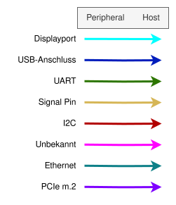
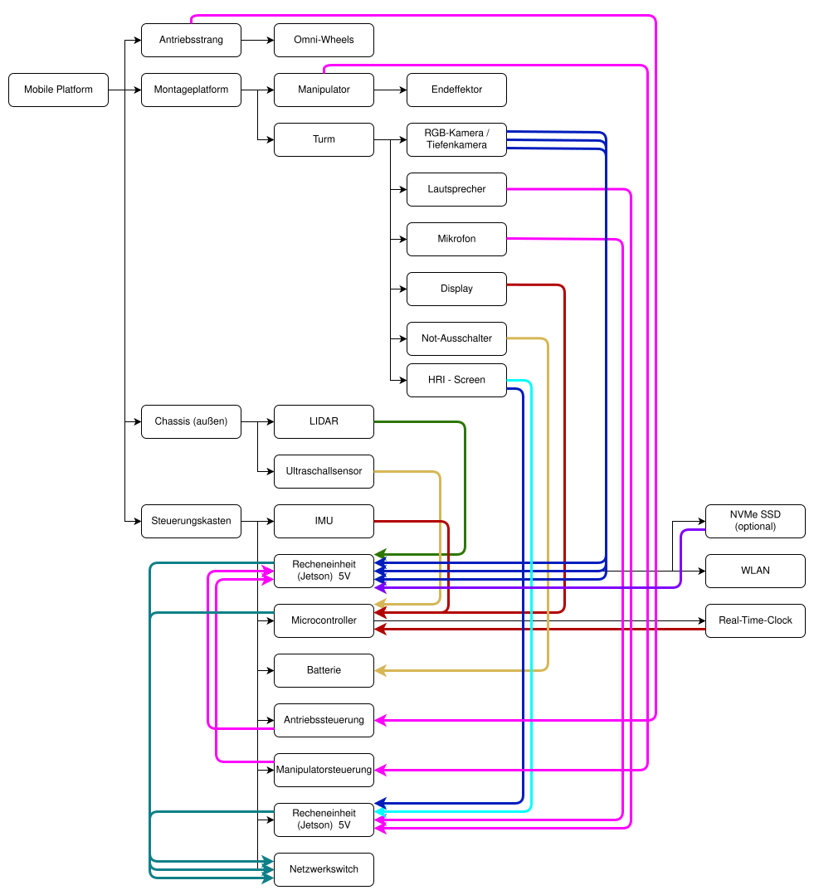

<!-- markdownlint-disable MD033 -->
<!-- Allows inline html: in this case: allows   elements in tables -->

# 6. Deployment View
<!-- Technical infrastructure with environments, computers, processors, topologies. Mapping of (software) building blocks to infrastructure elements. -->

<!-- Software does not run without hardware. This underlying infrastructure can and will influence your system and some cross-cutting concepts. Therefore, you need to know the infrastructure.
Maybe the highest level deployment diagram is already contained in section 3. as technical context with your own infrastructure as ONE black box. In this section you will zoom into this black box using additional deployment diagrams.

Describe
- the distribution of your system to multiple locations, environments, computers, processors, ... as well as the physical connections between them

- important justification or motivation for this deployment structure

- Quality and/or performance features of the infrastructure

- the mapping of software artifacts to elements of the infrastructure, e.g. as table -->

- [6. Deployment View](#6-deployment-view)
  - [Hardware topology](#hardware-topology)
  - [Processing units](#processing-units)
  - [Docker setup](#docker-setup)
  - [Simulation](#simulation)

## Hardware topology

The following diagram contains the hardware components of the robot as planned. The black arrows visualize the physical topology, whereas the colored arrows visualize the data connections.

Note that this topology might be subject to change, as we do not have the final hardware.

## Processing units

The following table outlines which processing units have direct access to the robot's peripherals and run which software packages.

| Processing Unit | Directly connected peripherals                                                                                                    | On-device ROS packages/nodes                                                                                                                                                       | Other software                                                                                                                               |
|-----------------|-----------------------------------------------------------------------------------------------------------------------------------|------------------------------------------------------------------------------------------------------------------------------------------------------------------------------------|----------------------------------------------------------------------------------------------------------------------------------------------|
| Jetson 1        | - Physical control: Powertrain and Manipulator control units - LIDAR (maybe » Jetson 3) - 3x RGBD Camera (maybe » Jetson 3) | - pkg: arlab_computer_vision - pkg: arlab_perception - pkg: arlab_manipulation - pkg: arlab_movement - (external perception pkgs) - (external hardware driver pkgs) | - ubuntu 24.04 - docker --- arlab_docker image --- (external docker images) - robot hardware drivers                             |
| Jetson 2        | - HRI screen - Speaker - Microphone                                                                                         | - pkg: arlab_speech_controller - pkg: arlab_vizbox - pkg: arlab_decision_making - pkg: arlab_knowledge - node: global_safety                                           | - ubuntu 24.04 - docker --- arlab_docker image - audio drivers --- pipewire + plugins ----- rnnoise ----- echo suppression |
| (Jetson 3)      | This Jetson is optional. Might handle systems like perception                                                                     | TBD                                                                                                                                                                                | TBD                                                                                                                                          |
| Microcontroller | - Real Time Clock - IMU - Display                                                                                           | None                                                                                                                                                                               | TBD                                                                                                                                          |

All processing units communicate with each other via ethernet. (With a network switch in-between)

The local safety nodes are always deployed where their main package is located.

The split between the two Jetsons has the following reasons:

- Perception uses a full gpu and the HRI uses a full gpu -> have to be on separate hardware
- HRI also uses a lot of ram for the LLM -> not many other nodes can be placed on this jetson
- Other nodes/pkgs only use moderate amounts of cpu compute and can probably all be executed together on one jetson.
- A third Jetson might be necessary if the nodes require more compute than expected

## Docker setup

On all Jetson processing units docker is used to run all ROS packages (including this repo). Docker provides:

- a standardized environment across development (desktops), ci/cd and deployment on the jetsons
- versioning and dependency independence from the host OS
- hardware independence -> The docker containers can easily be moved between processing units to optimize the system

The main dockerfile can be found in [arlab_docker](https://git.rz.uni-augsburg.de/imech-m/autonomous_robotics_lab/arlab_docker).

Repositories containing ROS packages (like this arlab repo) can be placed inside the src folder to make them part of an arlab_docker image. This allows for different images with a common base.

## Simulation

Instead of the actual hardware (which at the time of writing is not yet available), a gazebo simulation is used.
It roughly provides the same ROS interfaces (topics/services) as the final hardware and can be used to partially test the system without the external hardware drivers.
