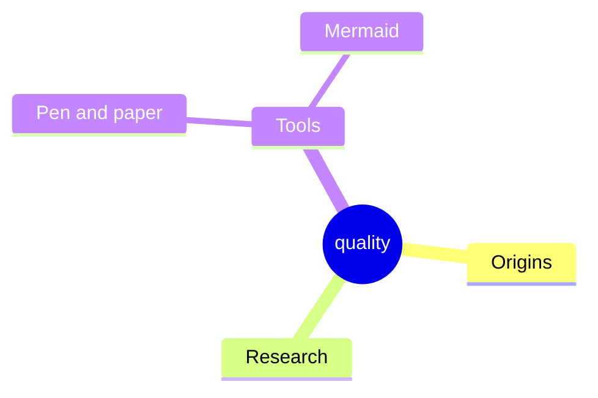

# 10. Quality Requirements
<!-- Quality requirements as scenarios, e.g. with quality tree to provide high-level overview. The most important quality goals should have been described in section 1.2. (quality goals).-->

## Quality Tree

TODO: The tree structure with priorities provides an overview for a sometimes large number of quality requirements.The quality tree is a high-level overview of the quality goals and requirements:

- tree-like refinement of the term "quality". Use "quality" or "usefulness" as a root
- a mind map with quality categories as main branches
- useful link: <https://quality.arc42.org/>

THIS IS JUST AN EXAMPLE. PLEASE CHANGE:

## Quality Goals

The architecture's top quality goals, prioritized for their importance to project objectives and stakeholder needs:

1. **Safety**  
   Prioritize human safety and system integrity. The robot must operate without causing harm, even under failures or unexpected situations.

2. **Reliability**  
   Ensure that manipulator actions, movement, and database access are consistently successful and dependable.

3. **Robustness**  
   The system must handle diverse objects, environments, and unexpected events without failure.

4. **Real-time Capability**  
   Critical data and safety checks must be performed with minimal delay to ensure responsive and safe operation.

5. **Modularity & Maintainability**  
   Components (manipulator, database, safety mechanisms) should be easily replaceable, maintainable, and upgradable without disrupting the overall system.

   
Manipulation:
1. **Safety** : 
- No collisions with objects or humans
2. **Reliability**  
- The manipulator must to move to correct poses
- The manipulator has to grap at the right time
- The manipulator must to move with correct speed
- The manipulator must to move to correct poses
- - Secure grasping and placing of objects
3. **Robustness**  
- möglich viele Szenarien sollen abgedeckt werden
- der Roboter muss sich an die dynamische Umgebungung anpassen --> discovery
4. **Real-time Capability**  
- Aufgrund der dynamischen Umgebung in der Arena muss der Roboter in Echtzeit sich verhalten
5. **Modularity & Maintainability**
- Roboter soll aktuelle Technologien nutzen, aber diese sollen auch austauschbar sein
- Es muss gegeben sein, dass spätere Semester sich einfach einarbeiten und das System erweitern können
6. Flexibilität: Der Manipulator ist erweiterbar auch die anderen Aufgaben

Computer Vision:
- **Reliability** : zuverlässige Erkennung der Objekte
- Real Time Capability: die Daten sind die Grundlage für die anderen Komponenten
- **Modularity & Maintainability**:
    - Roboter soll aktuelle Technologien nutzen, aber diese sollen auch austauschbar sein
    - Es muss gegeben sein, dass spätere Semester sich einfach einarbeiten und das System erweitern können.
- Flexibilität: Der Computer Vision ist erweiterbar auch die anderen Aufgaben
- Robustheit: Weil die meisten Module von CV abhängig sind
  
Perception:
- Real Time Capability: die Sensordaten müssen in Echtzeit an Computer Vision weitergegeben werden
- Flexibilität: Falls weitere Sensoren eingebaut werden

Movement:

- Safety: No collisions (!) with humans or objects
- Safety - prioritize human safety and nonhuman integrity. Apply conservative collision avoidance & speed limits
- Robustness - the robot should be able to reliably move in a variety of different indoor-environments
- Adaptability - Replan on the fly in case of suddenly appearing unknown objects (moving human/pet, vacuum-cleaner-robot, person moving around in an office chair, ...)
- Predictability - Movement should be smooth and easily anticipated by people

Database:

- safe, fast and asynchron working database node
- database transections must not be blocking the remaining threads

Safety:

1. Usability - Safety features must be intuitive and accessible at any time (e.g. emergency stop button)
2. Redundancy - Safety must be ensured even if individual components fail
3. Robustness - The system must continue to operate safely under unexpected, stressful, or degraded conditions (e.g. sensor failures, node failures, recover from freeze situations) without causing unsafe behavior
4. Real-time capability - The data must be checked in "real time"
5. Maintainability - Safety mechanisms must be easy to test, validate, and update
