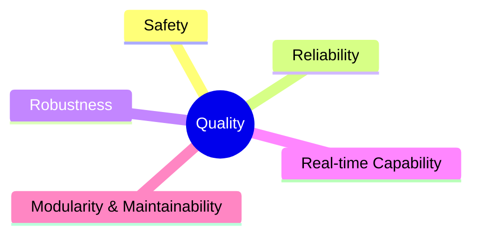
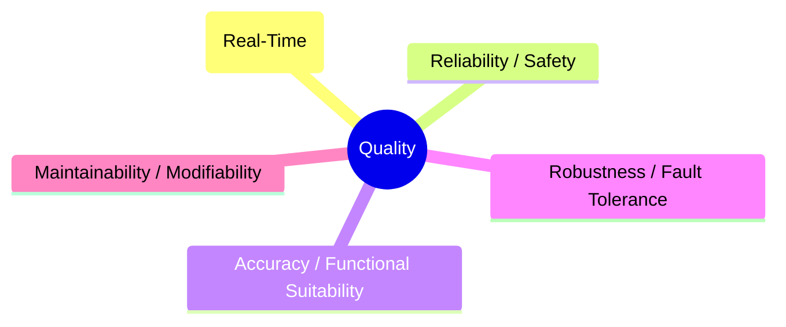
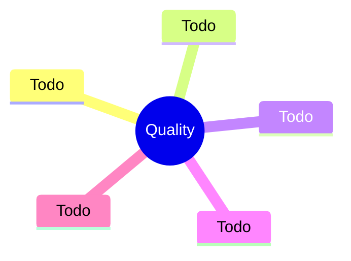
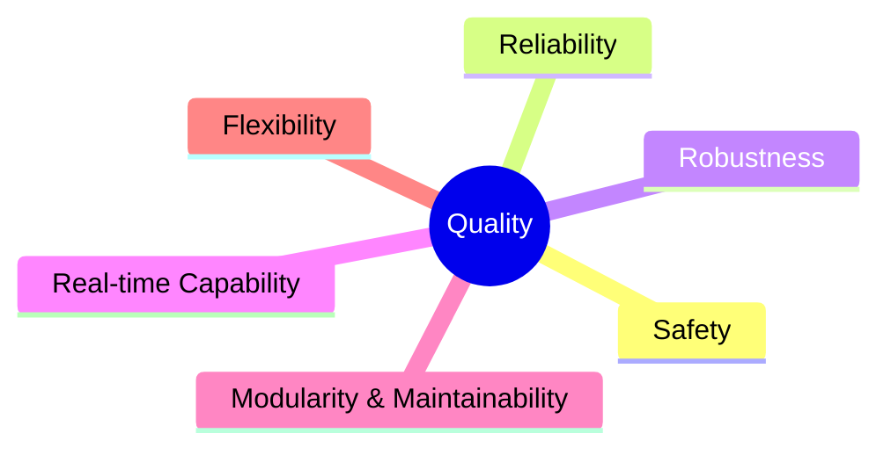
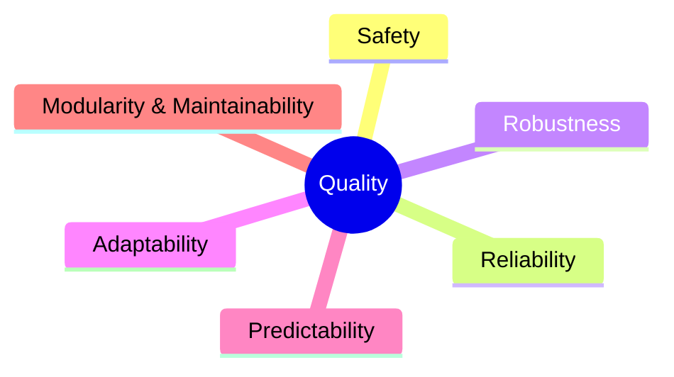
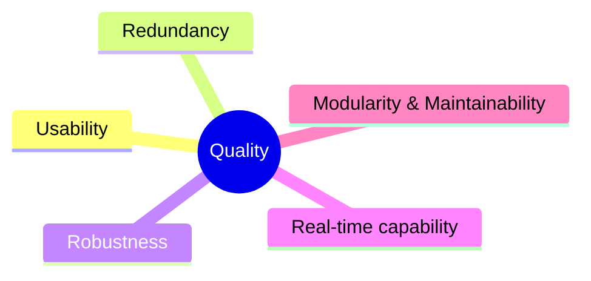

# Chapter 10 — Quality Requirements

This chapter collects the quality requirements for our system. We reference the most important goals already stated in [Chapter 1 — Introduction & Goals](./01-intro-goals.md#quality-goals) instead of repeating them, and add further quality requirements that are useful but not critical.

Section 10 is organized in two parts. First, an overview (10.1) summarizes requirements by category using a simple mind map or quality tree, following common models such as ISO/IEC 25010 or the arc42 quality tree. Second, detailed quality scenarios (10.2) make requirements concrete and testable. We use both runtime “usage” scenarios (how the system reacts to a stimulus, including performance) and “change” scenarios (what happens when we modify the system), each with clear acceptance criteria. For early drafts we prefer the short form (context and background, stimulus and source, measurable response). Long-form scenarios can be added later.

Our project is at a very early stage. Most key performance indicators are working targets based on initial experiments and are not yet validated. We will refine these targets as we collect more data and run hardware-in-the-loop tests. Formal validation and acceptance testing are planned for later phases.

The environment is a flat-like arena with household objects and occasional visitors. The robot assists with shopping tasks such as carrying bags, unloading groceries, and passing through doors. From this context we derive our priorities: human safety first, then low reaction time (target 20 updates per second on Jetson Orin Nano, primarily on-device), followed by detection accuracy, robustness under realistic disturbance, and maintainability across student cohorts.

Where possible, we express requirements as measurable targets and link them to verification through telemetry, dashboards, and acceptance tests. The scenario-based requirements in this chapter guide architectural decisions now and support architecture evaluation later.

## Quality Tree

The architecture’s top quality goals, prioritized for their importance to project objectives and stakeholder needs:

| Quality Category         | Quality                   | Description                                                                                          | Scenario |
|--------------------------|---------------------------|------------------------------------------------------------------------------------------------------|----------|
| Safety                   | Human Safety (1)          | Prioritize human safety and system integrity. The robot must operate without causing harm, even under failures or unexpected situations. |          |
| Reliability              | Consistency (2)           | Ensure that manipulator actions, movement, and database access are consistently successful and dependable. |          |
| Robustness               | Robustness (3)            | The system must handle diverse objects, environments, and unexpected events without failure.          |          |
| Performance              | Real-time Capability (4)  | Critical data and safety checks must be performed with minimal delay to ensure responsive and safe operation. |          |
| Maintainability          | Modularity & Maintainability (5) | Components (manipulator, database, safety mechanisms) should be easily replaceable, maintainable, and upgradable without disrupting the overall system. |          |

1. **Safety**
   Prioritize human safety and system integrity. The robot must operate without causing harm, even under failures or unexpected situations.

2. **Reliability**
   Ensure that manipulator actions, movement, and database access are consistently successful and dependable.

3. **Robustness**
   The system must handle diverse objects, environments, and unexpected events without failure.

4. **Real-time Capability**
   Critical data and safety checks must be performed with minimal delay to ensure responsive and safe operation.

5. **Modularity & Maintainability**
   Components (manipulator, database, safety mechanisms) should be easily replaceable, maintainable, and upgradable without disrupting the overall system.

## Data Pipeline (Perception => Computer Vision => Knowledge Base)

The modules Perception and Computer Vision can be visualized together because of their similarities regarding quality goals. Their key goal of serving data for all components makes performance, efficiency, reliability, accuracy, robustness, and modifiability indispensable.

1. **Performance / Efficiency (Real-Time)**
   - Target rate: 20 updates per second end-to-end (Camera => Computer Vision => Knowledge Base)

2. **Reliability / Safety**
   - Human (critical): At least 80 percent of all humans must be correctly detected when the overlap between predicted and true bounding boxes is at least 50 percent.
   - False negatives (missed humans) => trigger an immediate freeze; maximum allowed stop delay is 150 milliseconds from the image timestamp.
   - Data freshness: The Knowledge Base must not contain outdated states older than 100 milliseconds; outdated entries must be marked as “uncertain”.
   - Mandatory telemetry: For every frame, log the following values: processing latency in milliseconds, confidence score for human detection, whether a freeze was triggered.

3. **Accuracy / Functional Suitability**
   - Relevant object classes: Person, Shopping Bag, Door / “Open Door”, Table, Typical Groceries.
   - Target: At least 60 percent mean detection precision across classes at 50 percent bounding box overlap threshold; recall per class (correctly found objects) at least 80 percent.
   - For Doors / Open Doors: missed detections are tolerated only if the system recovers within one second.
   - World model coherence: Object tracking identifiers must remain consistent at least 80 percent of the time over one second; positional error for manipulable objects must not exceed 5 centimeters.

4. **Robustness / Fault Tolerance**
   - Degradation: In “Expo Mode” (background crowd) detection quality loss must not exceed 10 percent compared to laboratory conditions.
   - Fault tolerance: On image loss or partial sensor failure => extrapolate the last valid position for a maximum of 300 milliseconds, then enter degraded mode and raise a warning flag.
   - Self-diagnosis: Calibration mismatch or time synchronization drift greater than 5 milliseconds => set status “degraded” in the Knowledge Base.

5. **Maintainability / Modifiability**
   - Versioned interfaces: Schema and model version must be included in every message; semantic versioning with backward compatibility guaranteed for at least one minor version.
   - Reproducibility: Entire pipeline must be containerized; complete cold start on Orin Nano hardware must not exceed 30 minutes.

## Database

- safe, fast and asynchron working database node
- database transections must not be blocking the remaining threads

## Manipulation

1. **Safety**
   - No collisions with objects or humans

2. **Reliability**
   - The manipulator must to move to correct poses
   - The manipulator has to grap at the right time
   - The manipulator must to move with correct speed
   - The manipulator must to move to correct poses
   - Secure grasping and placing of objects

3. **Robustness**
   - möglich viele Szenarien sollen abgedeckt werden
   - der Roboter muss sich an die dynamische Umgebungung anpassen --> discovery

4. **Real-time Capability**
   - Aufgrund der dynamischen Umgebung in der Arena muss der Roboter in Echtzeit sich verhalten

5. **Modularity & Maintainability**
   - Roboter soll aktuelle Technologien nutzen, aber diese sollen auch austauschbar sein
   - Es muss gegeben sein, dass spätere Semester sich einfach einarbeiten und das System erweitern können

6. **Flexibilität**
   - Der Manipulator ist erweiterbar auch die anderen Aufgaben

## Movement

1. **Safety**
   - No collisions (!) with humans or objects

2. **Reliability**
   - prioritize human safety and nonhuman integrity. Apply conservative collision avoidance and speed limits

3. **Robustness**
   - the robot should be able to reliably move in a variety of different indoor environments

4. **Adaptability**
   - Replan on the fly in case of suddenly appearing unknown objects (moving human or pet, vacuum-cleaner robot, person moving around in an office chair)

5. **Predictability**
   - Movement should be smooth and easily anticipated by people

## Safety

1. **Usability**
   - Safety features must be intuitive and accessible at any time (for example emergency stop button)

2. **Redundancy**
   - Safety must be ensured even if individual components fail

3. **Robustness**
   - The system must continue to operate safely under unexpected, stressful, or degraded conditions (for example sensor failures, node failures, recover from freeze situations) without causing unsafe behavior

4. **Real-time capability**
   - The data must be checked in real time

5. **Modularity & Maintainability**
   - Safety mechanisms must be easy to test, validate, and update

## 10.2 Quality Scenarios

| Id  | Scenario |
|-----|----------|
| SC1 | A missed or uncertain human detection triggers an immediate freeze with time to stop <= 150 ms from the image timestamp. |
| SC2 | The perception => computer vision => world model => knowledge base pipeline sustains 20 updates per second for 10 minutes with 95th percentile end to end latency <= 80 ms and drop rate <= 1 percent. |
| SC3 | The knowledge base contains no states older than 100 ms, and any older entry is flagged as uncertain and not used for motion decisions. |
| SC4 | In an expo like environment with background crowd, detection quality for person and shopping bag drops by at most 10 percent compared to the lab baseline. |
| SC5 | A new team member performs a containerized cold start on Jetson Orin Nano in <= 30 minutes and reaches nominal operation at 20 updates per second. |

---

### SC1 — Human detection freeze

**Context**
Normal operation in the arena.

**Stimulus**
A human is present but the detector output is missed or has confidence below the human threshold.

**Expected response**
The robot enters freeze and stops moving safely.

**Acceptance criteria**
Time to stop from the image timestamp is <= 150 ms.

**Verification**
Replay test or live run with timestamped video and logs. Measure stop latency from frame time to freeze event.

---

### SC2 — Throughput and latency

**Context**
Continuous operation with the full pipeline active.

**Stimulus**
Ten minute run with live camera input.

**Expected response**
Stable streaming and processing without backlog.

**Acceptance criteria**
Throughput 20 updates per second.
95th percentile end to end latency <= 80 ms.
Frame drop rate <= 1 percent.

**Verification**
Collect telemetry for throughput, per frame latency, and drops. Review dashboard or log summary.

---

### SC3 — Data freshness guard

**Context**
World model and knowledge base in normal operation.

**Stimulus**
Any entry that is not updated within 100 ms.

**Expected response**
Outdated entries are flagged as uncertain and ignored by motion planning.

**Acceptance criteria**
No entry older than 100 ms remains unflagged.
Flagged entries are not consumed by motion planning.

**Verification**
Inject delays or pause the camera. Inspect logs and knowledge base flags. Confirm planner ignores flagged items.

---

### SC4 — Expo robustness

**Context**
Expo like environment with background visitors and moderate occlusion.

**Stimulus**
Repeat the lab test set under expo conditions.

**Expected response**
Graceful quality degradation.

**Acceptance criteria**
Detection quality for person and shopping bag decreases by at most 10 percent compared to the lab baseline using the same metric.

**Verification**
Run the labeled test set in lab and in expo setting. Compare the chosen metric across both runs.

---

### SC5 — Cold start on Orin Nano

**Context**
Fresh device with no containers or caches.

**Stimulus**
A new team member follows the readme to start the system.

**Expected response**
System comes up and streams detections to the knowledge base.

**Acceptance criteria**
Cold start time <= 30 minutes.
Pipeline reaches 20 updates per second.

**Verification**
Time the process from power on to the first steady 20 Hz stream. Record timings and any blockers.
