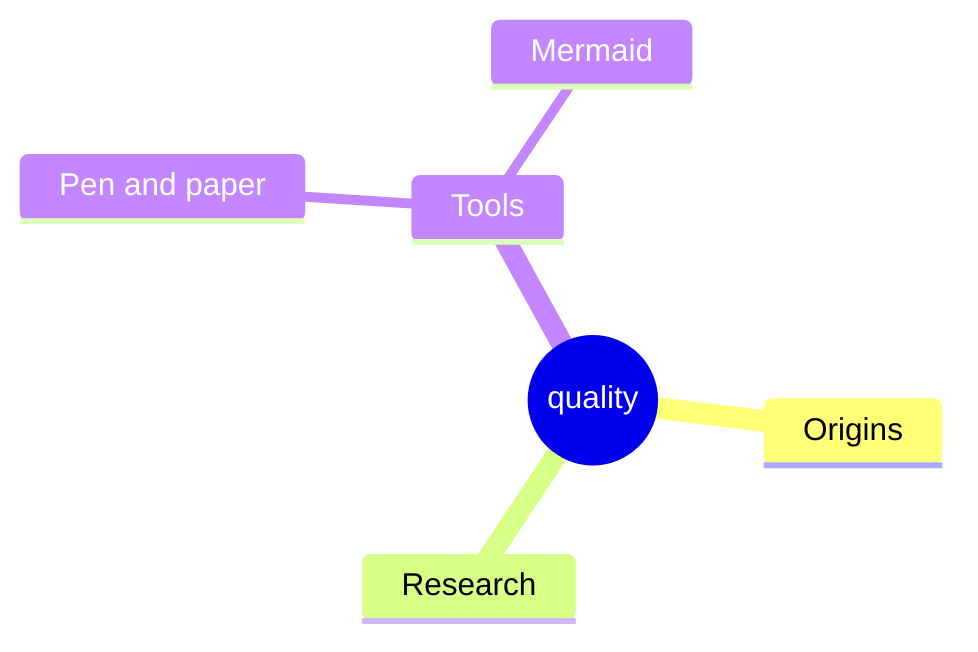

# 10. Quality Requirements
<!-- Quality requirements as scenarios, e.g. with quality tree to provide high-level overview. The most important quality goals should have been described in section 1.2. (quality goals).-->

## Quality Tree
TODO: The tree structure with priorities provides an overview for a sometimes large number of quality requirements.The quality tree is a high-level overview of the quality goals and requirements:
- tree-like refinement of the term "quality". Use "quality" or "usefulness" as a root
- a mind map with quality categories as main branches
- useful link: https://quality.arc42.org/

THIS IS JUST AN EXAMPLE. PLEASE CHANGE:
