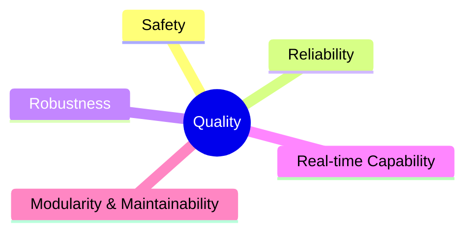
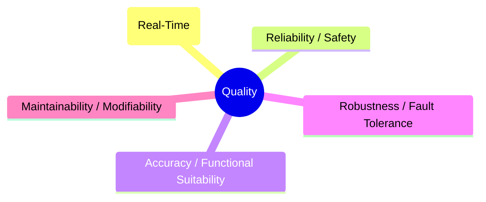
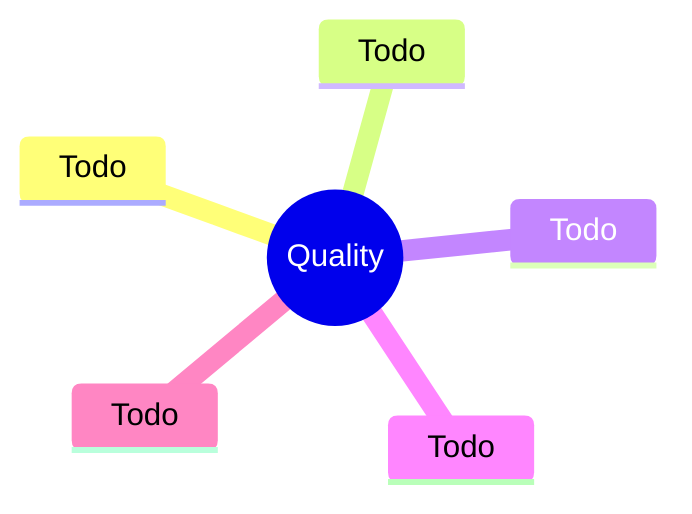
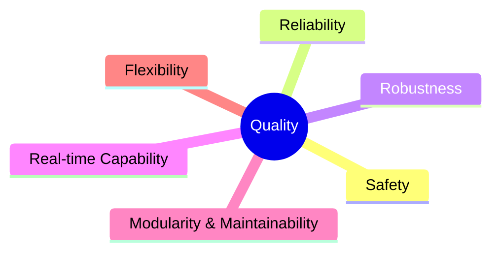
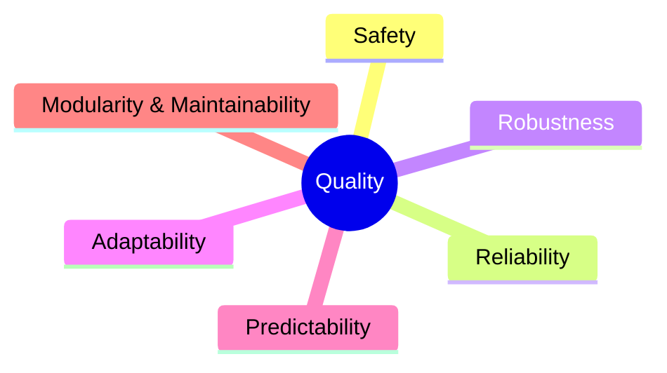
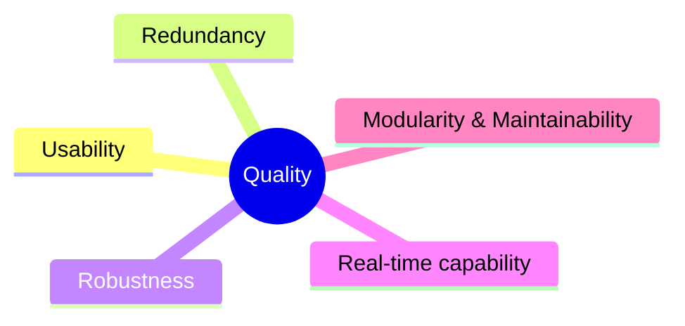

# Chapter 10 — Quality Requirements

This chapter collects the quality requirements for our system. We reference the most important goals already stated in [Chapter 1 — Introduction & Goals](./01-intro-goals.md#quality-goals) instead of repeating them, and add further quality requirements that are useful but not critical.

Section 10 is organized in two parts. First, an overview (10.1) summarizes requirements by category using a simple mind map or quality tree, following common models such as ISO/IEC 25010 or the arc42 quality tree. Second, detailed quality scenarios (10.2) make requirements concrete and testable. We use both runtime “usage” scenarios (how the system reacts to a stimulus, including performance) and “change” scenarios (what happens when we modify the system), each with clear acceptance criteria. For early drafts we prefer the short form (context and background, stimulus and source, measurable response). Long-form scenarios can be added later.

Our project is at a very early stage. Most key performance indicators are working targets based on initial experiments and are not yet validated. We will refine these targets as we collect more data and run hardware-in-the-loop tests. Formal validation and acceptance testing are planned for later phases.

The environment is a flat-like arena with household objects and occasional visitors. The robot assists with shopping tasks such as carrying bags, unloading groceries, and passing through doors. From this context we derive our priorities: human safety first, then low reaction time (target 20 updates per second on Jetson Orin Nano, primarily on-device), followed by detection accuracy, robustness under realistic disturbance, and maintainability across student cohorts.

Where possible, we express requirements as measurable targets and link them to verification through telemetry, dashboards, and acceptance tests. The scenario-based requirements in this chapter guide architectural decisions now and support architecture evaluation later.

## Quality Tree

The architecture’s top quality goals, prioritized for their importance to project objectives and stakeholder needs:

| Quality Category            | Quality         | Description                                                                                                                       | Scenario |
|-----------------------------|-----------------|-----------------------------------------------------------------------------------------------------------------------------------|----------|
| Safety                      | Human Safety    | The robot must prioritize human safety and system integrity. It must operate without causing harm, even in case of failures or unexpected situations. |          |
| Reliability                 | Consistency     | Manipulator actions, movements, and database access must always succeed reliably and predictably.                                |          |
| Robustness                  | Fault Tolerance | The system must remain operational when handling diverse objects, environments, and unexpected events.                            |          |
| Real-time Capability        | Responsiveness  | Critical data processing and safety checks must be executed with minimal delay to guarantee safe and responsive operation.        |          |
| Modularity & Maintainability | Maintainability | System components (manipulator, database, safety mechanisms) must be replaceable, maintainable, and upgradable without disrupting the overall system. |          |

## Data Pipeline (Perception => Computer Vision => Knowledge Base)

The modules Perception and Computer Vision can be visualized together because of their similarities regarding quality goals. Their key goal of serving data for all components makes performance, efficiency, reliability, accuracy, robustness, and modifiability indispensable.

| Quality Category             | Quality / Aspect        | Description                                                                                                                                     | Scenario |
|-------------------------------|-------------------------|-------------------------------------------------------------------------------------------------------------------------------------------------|----------|
| Performance / Efficiency      | Real-Time Updates       | Target rate: 20 updates per second end-to-end (Camera ⇒ Computer Vision ⇒ Knowledge Base).                                                      |          |
| Reliability / Safety          | Human Detection         | At least 80% of all humans must be correctly detected when overlap ≥ 50% between predicted and true bounding boxes.                             |          |
|                               | Fail-Safe Response      | False negatives (missed humans) ⇒ trigger an immediate freeze; maximum allowed stop delay is 150 ms from the image timestamp.                    |          |
|                               | Data Freshness          | Knowledge Base must not contain outdated states older than 100 ms; outdated entries must be marked as “uncertain”.                              |          |
|                               | Mandatory Telemetry     | For every frame, log: processing latency (ms), confidence score for human detection, and whether a freeze was triggered.                         |          |
| Accuracy / Functional Suitability | Object Detection     | Relevant classes: Person, Shopping Bag, Door/Open Door, Table, Groceries. Target: ≥ 60% mean precision @ 50% IoU; recall per class ≥ 80%.       |          |
|                               | Door Handling           | Missed detections of Doors/Open Doors tolerated only if recovered within 1 second.                                                              |          |
|                               | World Model Coherence   | Tracking IDs consistent ≥ 80% over 1 second; positional error for manipulable objects ≤ 5 cm.                                                   |          |
| Robustness / Fault Tolerance  | Degradation             | In “Expo Mode” (crowd), detection quality loss must not exceed 10% compared to laboratory conditions.                                           |          |
|                               | Fault Tolerance         | On image loss or partial sensor failure ⇒ extrapolate last valid position ≤ 300 ms, then enter degraded mode and raise warning flag.             |          |
|                               | Self-Diagnosis          | Calibration mismatch or time drift > 5 ms ⇒ set Knowledge Base status to “degraded”.                                                            |          |
| Maintainability / Modifiability | Versioned Interfaces  | Schema & model version included in every message; semantic versioning with backward compatibility guaranteed for ≥ one minor version.            |          |
|                               | Reproducibility         | Entire pipeline must be containerized; cold start on Orin Nano hardware ≤ 30 minutes.                                                           |          |

## Database

- safe, fast and asynchron working database node
- database transections must not be blocking the remaining threads

## Manipulation

| Quality Category            | Quality / Aspect    | Description                                                                                                                   | Scenario |
|------------------------------|---------------------|-------------------------------------------------------------------------------------------------------------------------------|----------|
| Safety                       | Collision Avoidance | The robot must not collide with humans or objects under any circumstances.                                                    |          |
| Reliability                  | Correct Poses       | The manipulator must reach and maintain correct poses with defined accuracy.                                                  |          |
|                              | Timing              | The manipulator must grasp objects at the correct time as required by the task sequence.                                      |          |
|                              | Speed               | The manipulator must move with correct and controlled speed according to defined limits.                                      |          |
|                              | Acceleration        | The manipulator must move with correct and controlled acceleration according to defined limits.                               |          |
|                              | Grasp & Place       | The manipulator must securely grasp and place objects without loss or damage.                                                 |          |
| Robustness                   | Scenario Coverage   | The system must operate reliably across all predefined test scenarios (e.g., office, corridor, arena).                        |          |
|                              | Adaptation          | The robot must adapt its behavior to dynamic changes in the environment by rediscovering free space and adjusting its plan.   |          |
| Real-time Capability         | Real-time Behavior  | The robot must update planning and control frequently enough to guarantee real-time responsiveness in dynamic environments.   |          |
| Modularity & Maintainability | Technology Choice   | The system must use up-to-date technologies that are replaceable without affecting overall system integrity.                   |          |
|                              | Long-term Usability | The system must allow future developers to familiarize themselves quickly and extend the system with minimal integration effort. |          |
| Flexibility                  | Extensibility       | The manipulator must be extendable to support additional tasks beyond the initial scope.                                      |          |

## Movement

| Quality Category  | Quality / Aspect    | Description                                                                                                                                | Scenario |
|-------------------|---------------------|--------------------------------------------------------------------------------------------------------------------------------------------|----------|
| Safety            | Collision Avoidance | The robot must not collide with humans or objects under any circumstances.                                                                |          |
| Reliability       | Safe Operations     | The robot must prioritize human safety and the integrity of its environment by applying conservative collision avoidance and speed limits. |          |
| Robustness        | Indoor Environments | The robot must reliably move in a variety of different indoor environments.                                                               |          |
| Adaptability      | Dynamic Replanning  | The robot must replan its route on the fly when suddenly appearing unknown objects occur (e.g., human, pet, vacuum-cleaner, office chair). |          |
| Predictability    | Smooth Movements    | The robot’s movements must be smooth and easily anticipated by humans.                                                                   |          |

## Safety

## 10.2 Quality Scenarios

| Id  | Scenario |
|-----|----------|
| SC1 | A missed or uncertain human detection triggers an immediate freeze with time to stop <= 150 ms from the image timestamp. |
| SC2 | The perception => computer vision => world model => knowledge base pipeline sustains 20 updates per second for 10 minutes with 95th percentile end to end latency <= 80 ms and drop rate <= 1 percent. |
| SC3 | The knowledge base contains no states older than 100 ms, and any older entry is flagged as uncertain and not used for motion decisions. |
| SC4 | In an expo like environment with background crowd, detection quality for person and shopping bag drops by at most 10 percent compared to the lab baseline. |
| SC5 | A new team member performs a containerized cold start on Jetson Orin Nano in <= 30 minutes and reaches nominal operation at 20 updates per second. |

---

### SC1 — Human detection freeze

**Context**
Normal operation in the arena.

**Stimulus**
A human is present but the detector output is missed or has confidence below the human threshold.

**Expected response**
The robot enters freeze and stops moving safely.

**Acceptance criteria**
Time to stop from the image timestamp is <= 150 ms.

**Verification**
Replay test or live run with timestamped video and logs. Measure stop latency from frame time to freeze event.

---

### SC2 — Throughput and latency

**Context**
Continuous operation with the full pipeline active.

**Stimulus**
Ten minute run with live camera input.

**Expected response**
Stable streaming and processing without backlog.

**Acceptance criteria**
Throughput 20 updates per second.
95th percentile end to end latency <= 80 ms.
Frame drop rate <= 1 percent.

**Verification**
Collect telemetry for throughput, per frame latency, and drops. Review dashboard or log summary.

---

### SC3 — Data freshness guard

**Context**
World model and knowledge base in normal operation.

**Stimulus**
Any entry that is not updated within 100 ms.

**Expected response**
Outdated entries are flagged as uncertain and ignored by motion planning.

**Acceptance criteria**
No entry older than 100 ms remains unflagged.
Flagged entries are not consumed by motion planning.

**Verification**
Inject delays or pause the camera. Inspect logs and knowledge base flags. Confirm planner ignores flagged items.

---

### SC4 — Expo robustness

**Context**
Expo like environment with background visitors and moderate occlusion.

**Stimulus**
Repeat the lab test set under expo conditions.

**Expected response**
Graceful quality degradation.

**Acceptance criteria**
Detection quality for person and shopping bag decreases by at most 10 percent compared to the lab baseline using the same metric.

**Verification**
Run the labeled test set in lab and in expo setting. Compare the chosen metric across both runs.

---

### SC5 — Cold start on Orin Nano

**Context**
Fresh device with no containers or caches.

**Stimulus**
A new team member follows the readme to start the system.

**Expected response**
System comes up and streams detections to the knowledge base.

**Acceptance criteria**
Cold start time <= 30 minutes.
Pipeline reaches 20 updates per second.

**Verification**
Time the process from power on to the first steady 20 Hz stream. Record timings and any blockers.
