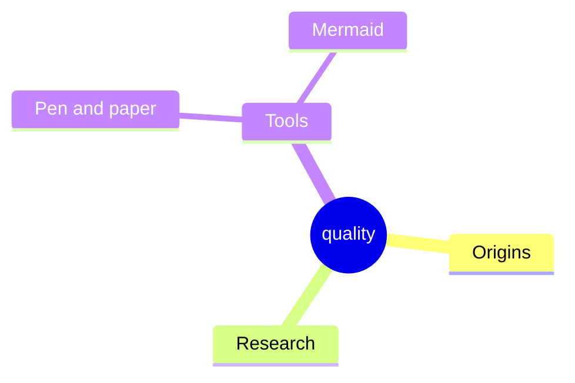

# 10. Quality Requirements
<!-- Quality requirements as scenarios, e.g. with quality tree to provide high-level overview. The most important quality goals should have been described in section 1.2. (quality goals).-->

## Quality Tree

TODO: The tree structure with priorities provides an overview for a sometimes large number of quality requirements.The quality tree is a high-level overview of the quality goals and requirements:

- tree-like refinement of the term "quality". Use "quality" or "usefulness" as a root
- a mind map with quality categories as main branches
- useful link: <https://quality.arc42.org/>

THIS IS JUST AN EXAMPLE. PLEASE CHANGE:

Manipulation:

- The manipulator must not move to incorrect poses
- No collisions with objects or humans
- Intuitive driving commands and object names (traceability of the grasp target)
- Timely response to driving commands
- Secure grasping and placing of objects

Database:

- safe, fast and asynchron working database node
- database transections must not be blocking the remaining threads

Safety:

1. Usability - Safety features must be intuitive and accessible at any time (e.g. emergency stop button)
2. Redundancy - Safety must be ensured even if individual components fail
3. Robustness - The system must continue to operate safely under unexpected, stressful, or degraded conditions (e.g. sensor failures, node failures, recover from freeze situations) without causing unsafe behavior
4. Real-time capability - The data must be checked in "real time"
5. Maintainability - Safety mechanisms must be easy to test, validate, and update
