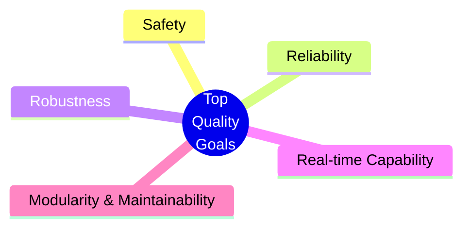
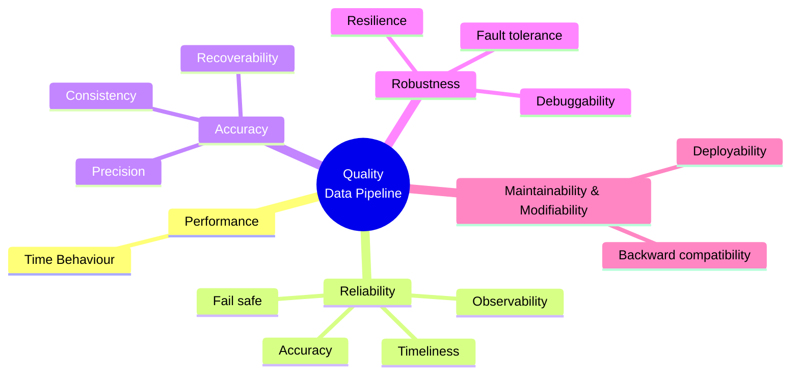
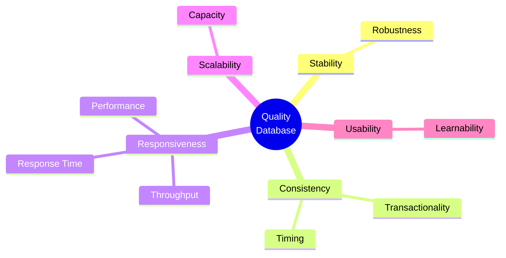
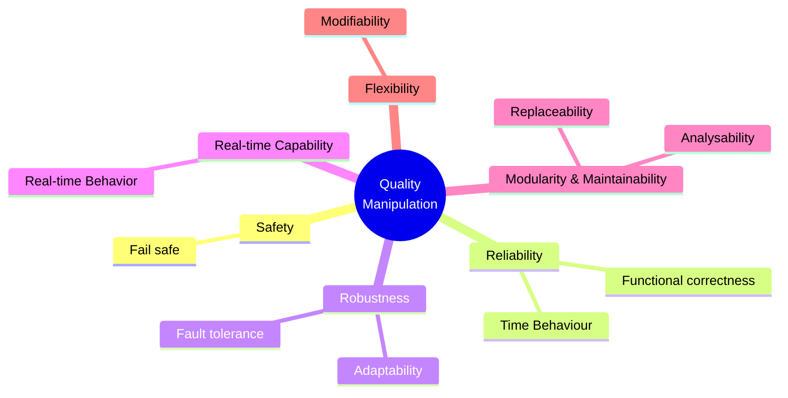
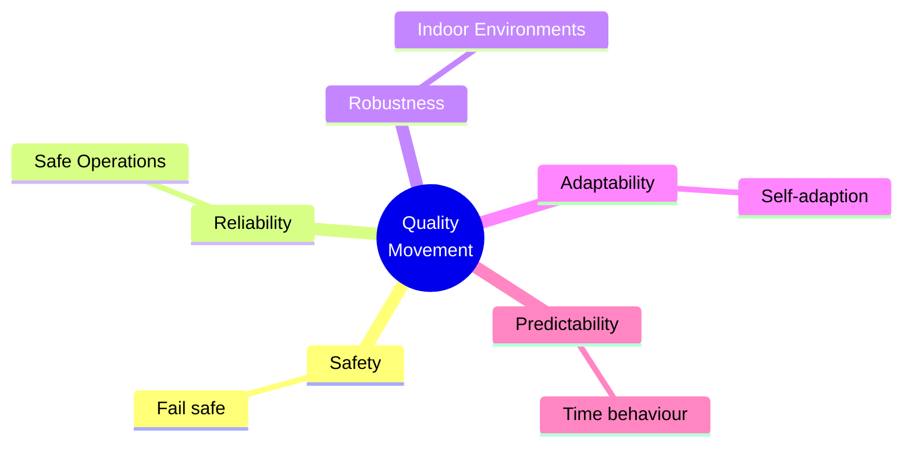
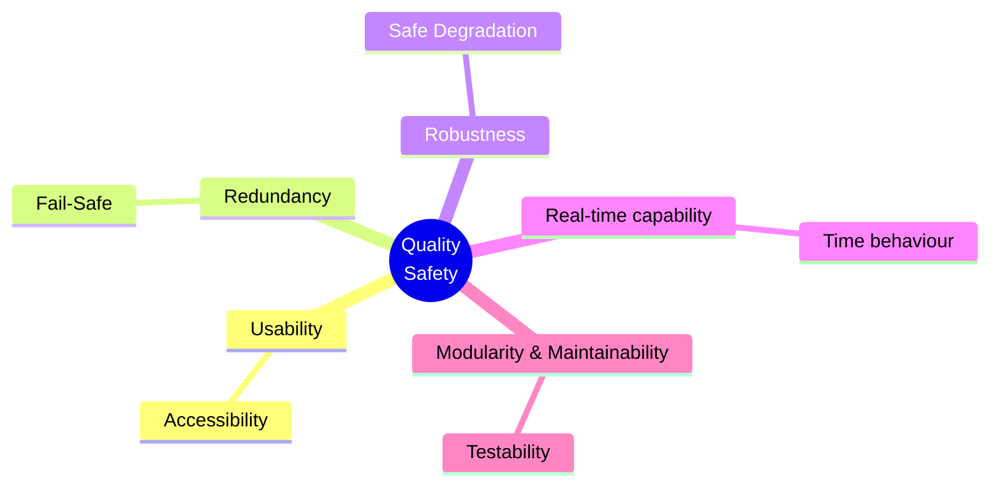

# Chapter 10 — Quality Requirements

This chapter collects the quality requirements for our system. We reference the most important goals already stated in [Chapter 1 — Introduction & Goals](./01.%20Introduction%20and%20Goals.md#quality-goals) instead of repeating them, and add further quality requirements that are useful but not critical.

Section 10 is organized in two parts. First, an overview (10.1) summarizes requirements by category using a simple mind map or quality tree, following the common arc42 quality tree. Second, detailed quality scenarios (10.2) make requirements concrete and testable. We use both runtime “usage” scenarios (how the system reacts to a stimulus, including performance) and “change” scenarios (what happens when we modify the system), each with clear acceptance criteria. For early drafts we prefer the short form (context and background, stimulus and source, measurable response). Long-form scenarios can be added later.

Our project is at a very early stage. Most key performance indicators are working targets based on initial experiments and are not yet validated. We will refine these targets as we collect more data and run hardware-in-the-loop tests. Formal validation and acceptance testing are planned for later phases.

The environment is a flat-like arena with household objects and occasional visitors. The robot assists with shopping tasks such as carrying bags, unloading groceries, and passing through doors. From this context we derive our priorities: human safety first, then low reaction time (target 20 updates per second on Jetson Orin Nano, primarily on-device), followed by detection accuracy, robustness under realistic disturbance, and maintainability across student cohorts.

Where possible, we express requirements as measurable targets and link them to verification through telemetry, dashboards, and acceptance tests. The scenario-based requirements in this chapter guide architectural decisions now and support architecture evaluation later.

## Quality Tree

The architecture’s top quality goals, prioritized for their importance to project objectives and stakeholder needs:

| Quality Category              | Description                                                                                                                       |
|------------------------------|-----------------------------------------------------------------------------------------------------------------------------------|
| Safety                       | The robot must prioritize human safety and system integrity. It must operate without causing harm, even in case of failures or unexpected situations. |
| Reliability                  | Manipulator actions, movements, and database access must always succeed reliably and predictably.                                |
| Robustness                   | The system must remain operational when handling diverse objects, environments, and unexpected events.                            |
| Real-time Capability         | Critical data processing and safety checks must be executed with minimal delay to guarantee safe and responsive operation.        |
| Modularity & Maintainability | System components (manipulator, database, safety mechanisms) must be replaceable, maintainable, and upgradable without disrupting the overall system. |

---

## Data Pipeline (Perception → Computer Vision → Knowledge Base)

The modules Perception and Computer Vision can be visualized together because of their similarities regarding quality goals. Their key goal of serving data for all components makes performance, efficiency, reliability, accuracy, robustness, and modifiability indispensable.

| Quality Category               | Quality / Aspect        | Description                                                                                                                                     | Scenario |
|--------------------------------|-------------------------|-------------------------------------------------------------------------------------------------------------------------------------------------|----------|
| Performance                    | Time Behaviour          | Target rate: 20 updates per second end-to-end (Camera → Computer Vision → Knowledge Base).                                                     | [SC2 — Throughput and latency](#sc2-throughput-and-latency) |
| Reliability                    | Accuracy                | At least 80% of all humans must be correctly detected when overlap ≥ 50% between predicted and true bounding boxes.                            | [SC6 — Human detection accuracy baseline](#sc6-human-detection-accuracy) |
|                                | Fail safe               | False negatives (missed humans) → trigger an immediate freeze; maximum allowed stop delay is 150 ms from the image timestamp.                   | [SC1 — Human detection freeze](#sc1-human-detection-freeze) |
|                                | Timeliness              | Knowledge Base must not contain outdated states older than 100 ms; outdated entries must be marked as “uncertain”.                             | [SC3 — Data freshness guard](#sc3-data-freshness-guard) |
|                                | Observability           | For every frame, log: processing latency (ms), confidence score for human detection, and whether a freeze was triggered.                        | [SC2 — Throughput and latency](#sc2-throughput-and-latency) |
| Accuracy                       | Precision               | Relevant classes: Person, Shopping Bag, Door/Open Door, Table, Groceries. Target: ≥ 60% mean precision @ 50% IoU; recall per class ≥ 80%.      | [SC6 — Human detection accuracy baseline](#sc6-human-detection-accuracy) |
|                                | Recoverability          | Missed detections of Doors/Open Doors tolerated only if recovered within 1 second.                                                              |          |
|                                | Consistency             | Tracking IDs consistent ≥ 80% over 1 second; positional error for manipulable objects ≤ 5 cm.                                                  | [SC7 — World model coherence](#sc7-world-model-coherence) |
| Robustness                     | Resilience              | In “Expo Mode” (crowd), detection quality loss must not exceed 10% compared to laboratory conditions.                                          | [SC4 — Expo robustness](#sc4-expo-robustness) |
|                                | Fault tolerance         | On image loss or partial sensor failure ⇒ extrapolate last valid position ≤ 300 ms, then enter degraded mode and raise warning flag.            | [SC8 — Sensor dropout tolerance](#sc8-sensor-dropout-tolerance) |
|                                | Debuggability           | Calibration mismatch or time drift > 5 ms → set Knowledge Base status to “degraded”.                                                           |          |
| Maintainability & Modifiability| Backward compatibility    | Schema & model version included in every message; semantic versioning with backward compatibility guaranteed for ≥ one minor version.           |          |
|                                | Deployability         | Entire pipeline must be containerized; cold start on Orin Nano hardware ≤ 30 minutes.                                                          | [SC5 — Cold start on Orin Nano](#sc5-cold-start-on-orin-nano) |

---

## Database

| Quality Category | Quality / Aspect        | Description                                                                                                                                     | Scenario |
|------------------|-------------------------|-------------------------------------------------------------------------------------------------------------------------------------------------|----------|
| Stability        | Robustness              | The database service must handle malformed inputs, schema mismatches, retries, and partial failures gracefully without crashes or data corruption. |          |
| Consistency      | Transactionality        | Reads and writes must be atomic and isolated at the chosen isolation level so multi-step updates commit all or nothing and keep data correct.   |          |
|       | Timing                  | Ensure temporal consistency with ordered updates and bounded staleness so clients observe fresh data and reads reflect recent successful writes. | [SC3 — Data freshness guard](#sc3-data-freshness-guard) |
| Responsiveness   | Performance             | Maintain predictable performance under concurrent access from many nodes through efficient indexing, connection pooling, and resource limits.   | [SC2 — Throughput and latency](#sc2-throughput-and-latency) |
|    | Response Time           | Typical read and write operations should complete within a low and stable 95th percentile latency suitable for real-time robot control.        | [SC2 — Throughput and latency](#sc2-throughput-and-latency) |
|    | Throughput              | Sustain a high rate of read and write operations without backpressure so pipelines and planners are not stalled.                               | [SC2 — Throughput and latency](#sc2-throughput-and-latency) |
| Scalability      | Capacity          | Scale with the number of nodes and data volume via horizontal scaling, partitioning, and caching while avoiding single bottlenecks and coordination limits. |          |
| Usability        | Learnability      | Provide a simple, well-documented API and schema with easy local setup, fixtures, clear error messages, migrations, and basic observability hooks. |          |

---

## Manipulation

| Quality Category            | arc42 Quality (2nd column)              | Description                                                                                                                   | Scenario |
|----------------------------|------------------------------------------|-------------------------------------------------------------------------------------------------------------------------------|----------|
| Safety                     | Fail safe (hazard mitigation)            | The robot must not collide with humans or objects under any circumstances.                                                    | [SC1 — Human detection freeze](#sc1-human-detection-freeze) |
| Reliability                | Functional correctness (accuracy/precision) | The manipulator must reach and maintain correct poses with defined accuracy.                                                  |          |
|                            | Time behaviour (synchronization)         | The manipulator must grasp objects at the correct time as required by the task sequence.                                      |          |
|                            | Time behaviour (velocity limits)         | The manipulator must move with correct and controlled speed according to defined limits.                                      |          |
|                            | Time behaviour (acceleration/jerk limits)| The manipulator must move with correct and controlled acceleration according to defined limits.                               |          |
|                            | Functional correctness (manipulation)    | The manipulator must securely grasp and place objects without loss or damage.                                                 |          |
| Robustness                 | Fault tolerance                          | The system must operate reliably across all predefined test scenarios (e.g., office, corridor, arena).                        | [SC4 — Expo robustness](#sc4-expo-robustness) |
|                            | Adaptability                             | The robot must adapt its behavior to dynamic changes in the environment by rediscovering free space and adjusting its plan.   |          |
| Real-time Capability       | Time behaviour (real-time responsiveness)| The robot must update planning and control frequently enough to guarantee real-time responsiveness in dynamic environments.   | [SC2 — Throughput and latency](#sc2-throughput-and-latency) |
| Modularity & Maintainability | Replaceability                         | The system must use up-to-date technologies that are replaceable without affecting overall system integrity.                   |          |
|                            | Analysability                            | The system must allow future developers to familiarize themselves quickly and extend the system with minimal integration effort. | [SC5 — Cold start on Orin Nano](#sc5-cold-start-on-orin-nano) |
| Flexibility                | Modifiability (extensibility)            | The manipulator must be extendable to support additional tasks beyond the initial scope.                                      |          |

---

## Movement

| Quality Category  | Quality / Aspect    | Description                                                                                                                                | Scenario |
|-------------------|---------------------|--------------------------------------------------------------------------------------------------------------------------------------------|----------|
| Safety            | Fail safe           | The robot must not collide with humans or objects under any circumstances.                                                                | [SC1 — Human detection freeze](#sc1-human-detection-freeze) |
| Reliability       | Safe Operations     | The robot must prioritize human safety and the integrity of its environment by applying conservative collision avoidance and speed limits. |          |
| Robustness        | Indoor Environments | The robot must reliably move in a variety of different indoor environments.                                                               | [SC4 — Expo robustness](#sc4-expo-robustness) |
| Adaptability      | Self-adaptation  | The robot must replan its route on the fly when suddenly appearing unknown objects occur (e.g., human, pet, vacuum-cleaner, office chair). |          |
| Predictability    | Time behaviour    | The robot’s movements must be smooth and easily anticipated by humans.                                                                     |          |

---

## Safety

| Quality Category           | Quality / Aspect        | Description                                                                                                                                                  | Scenario |
|----------------------------|-------------------------|--------------------------------------------------------------------------------------------------------------------------------------------------------------|----------|
| Usability                  | Accessibility           | Safety features must be intuitive and accessible at any time (e.g., emergency stop button).                                                                  |          |
| Redundancy                 | Fail Safe               | Safety must be ensured even if individual components fail.                                                                                                   |          |
| Robustness                 | Safe Degradation        | The system must continue to operate safely under unexpected, stressful, or degraded conditions without causing unsafe behavior.                              | [SC8 — Sensor dropout tolerance](#sc8-sensor-dropout-tolerance) |
| Real-time Capability       |  Time behaviour         | The data must be checked in real time.                                                                                                                       | [SC2 — Throughput and latency](#sc2-throughput-and-latency) |
| Modularity & Maintainability | Testability           | Safety mechanisms must be easy to test, validate, and update.                                                                                                |          |

---

## 10.2 Quality Scenarios

| Id  | Scenario |
|-----|----------|
| SC1 | A missed or uncertain human detection triggers an immediate freeze with time to stop <= 150 ms from the image timestamp. |
| SC2 | The perception => computer vision => world model => knowledge base pipeline sustains 20 updates per second for 10 minutes with 95th percentile end to end latency <= 80 ms (computed over the last 5 minutes; exclude the first 30 seconds warm-up) and drop rate <= 1 percent. |
| SC3 | The knowledge base contains no states older than 100 ms, and any older entry is flagged as uncertain and not used for motion decisions. |
| SC4 | In an expo like environment with background crowd, detection quality for person and shopping bag drops by at most 10 percent compared to the lab baseline. |
| SC5 | A new team member performs a containerized cold start on Jetson Orin Nano in <= 30 minutes and reaches nominal operation at 20 updates per second. |
| SC6 | Person detection recall is >= 90 percent when the overlap between predicted and true bounding boxes is at least 50 percent on the arena test set. |
| SC7 | Tracking IDs stay consistent >= 95 percent over 1 second and position error for graspable objects is <= 5 cm. |
| SC8 | On camera frame loss up to 300 ms, the system extrapolates poses, enters degraded mode with a warning flag, and automatically recovers when frames resume. |

---

### SC1 — Human detection freeze

**Context**  
Normal operation in the arena.

**Stimulus**  
A human is present but the detector output is missed or has confidence below the human threshold.

**Expected response**  
The robot enters freeze and stops moving safely.

**Acceptance criteria**  
Time to stop from the image timestamp is <= 150 ms.

**Verification**  
Replay test or live run with timestamped video and logs. Measure stop latency from frame time to freeze event.

---

### SC2 — Throughput and latency

**Context**  
Continuous operation with the full pipeline active.

**Stimulus**  
Ten minute run with live camera input.

**Expected response**  
Stable streaming and processing without backlog.

**Acceptance criteria**  
Throughput 20 updates per second.  
95th percentile end to end latency <= 80 ms.  
Frame drop rate <= 1 percent.

**Verification**  
Collect telemetry for throughput, per frame latency, and drops. Review dashboard or log summary.

---

### SC3 — Data freshness guard

**Context**  
World model and knowledge base in normal operation.

**Stimulus**  
Any entry that is not updated within 100 ms.

**Expected response**  
Outdated entries are flagged as uncertain and ignored by motion planning.

**Acceptance criteria**  
No entry older than 100 ms remains unflagged.  
Flagged entries are not consumed by motion planning.

**Verification**  
Inject delays or pause the camera. Inspect logs and knowledge base flags. Confirm planner ignores flagged items.

---

### SC4 — Expo robustness

**Context**  
Expo like environment with background visitors and moderate occlusion.

**Stimulus**  
Repeat the lab test set under expo conditions.

**Expected response**  
Graceful quality degradation.

**Acceptance criteria**  
Detection quality for person and shopping bag decreases by at most 10 percent compared to the lab baseline using the same metric.

**Verification**  
Run the labeled test set in lab and in expo setting. Compare the chosen metric across both runs.

---

### SC5 — Cold start on Orin Nano

**Context**  
Fresh device with no containers or caches.

**Stimulus**  
A new team member follows the readme to start the system.

**Expected response**  
System comes up and streams detections to the knowledge base.

**Acceptance criteria**  
Cold start time <= 30 minutes.  
Pipeline reaches 20 updates per second.

**Verification**  
Time the process from power on to the first steady 20 Hz stream. Record timings and any blockers.

---

### SC6 — Human detection accuracy baseline

**Context**  
Arena test set with labeled human bounding boxes.

**Stimulus**  
Run the detector over the full test set.

**Expected response**  
High recall for human class at standard overlap threshold.

**Acceptance criteria**  
Person recall >= 90 percent when the overlap between predicted and true bounding boxes is >= 50 percent.  
Report overall recall and per-scene recall.

**Verification**  
Evaluate on the labeled dataset. Compute recall at 50 percent overlap. Publish a short metrics summary.

---

### SC7 — World model coherence

**Context**  
Normal operation with tracking enabled and graspable objects present.

**Stimulus**  
Continuous stream for at least 2 minutes with moderate motion of objects and the robot.

**Expected response**  
Stable tracking IDs and accurate positions for graspable objects.

**Acceptance criteria**  
Tracking ID continuity >= 95 percent over any 1 second window.  
Position error for graspable objects <= 5 cm compared to ground truth or fiducial measurements.

**Verification**  
Record a run with reference markers or ground truth measurements. Compute ID switches per track length and position error statistics.

---

### SC8 — Sensor dropout tolerance

**Context**  
Normal operation; occasional camera frame loss.

**Stimulus**  
Introduce a continuous camera frame gap of up to 300 ms.

**Expected response**  
System extrapolates last valid poses, marks degraded mode with a warning flag, and automatically returns to normal when frames resume.

**Acceptance criteria**  
Extrapolation covers up to 300 ms without planner stalls.  
Degraded mode flag is raised during the gap and cleared within 200 ms after frames resume.  
No unsafe motion is commanded during the gap.

**Verification**  
Inject frame drops or pause the camera stream. Inspect logs and flags. Check planner behavior and recovery timing.
