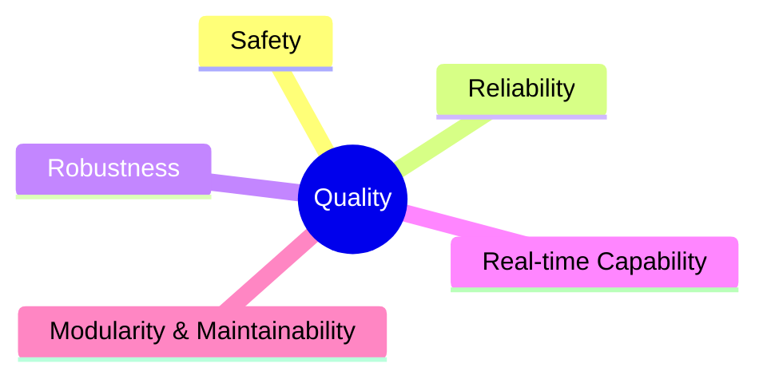
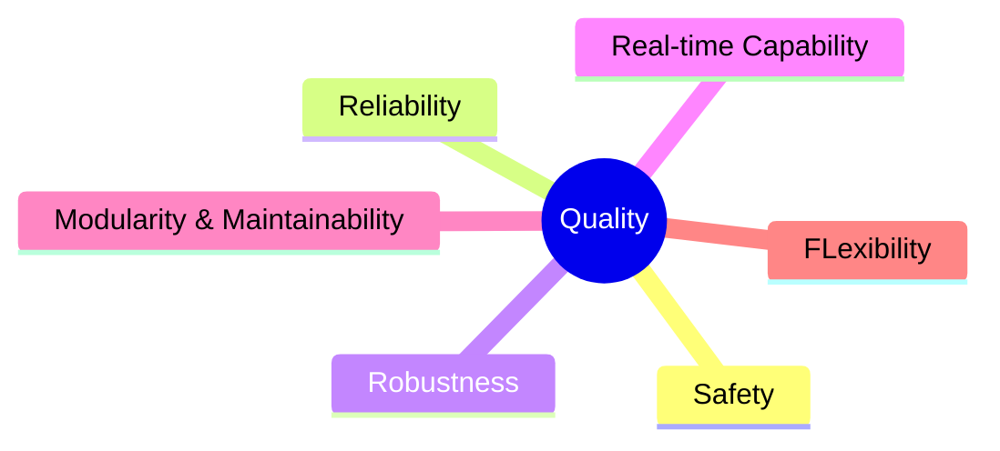
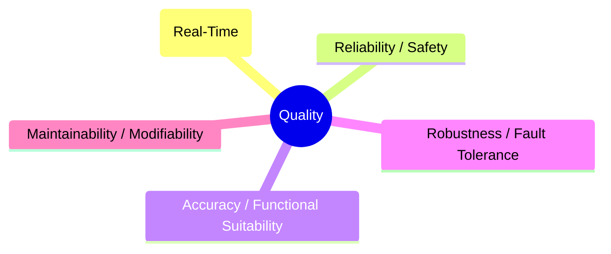
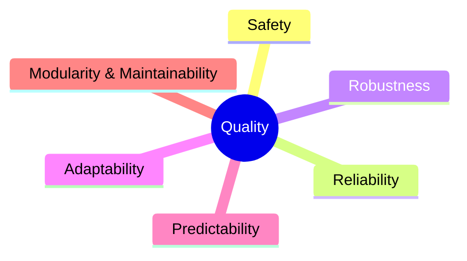
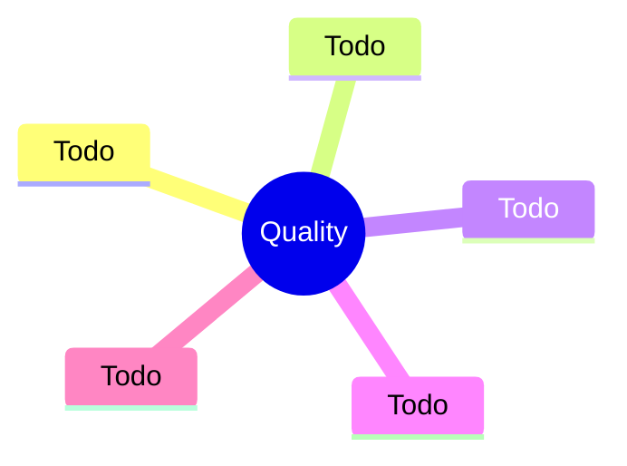
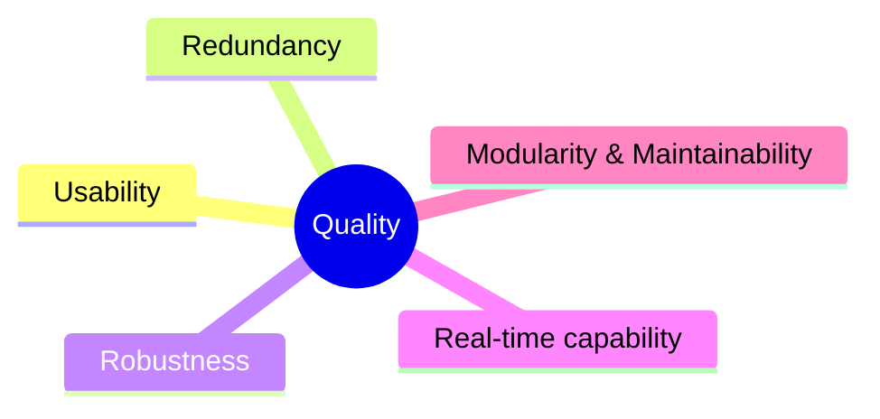

# 10. Quality Requirements
<!-- Quality requirements as scenarios, e.g. with quality tree to provide high-level overview. The most important quality goals should have been described in section 1.2. (quality goals).-->

## Quality Tree

TODO: The tree structure with priorities provides an overview for a sometimes large number of quality requirements.The quality tree is a high-level overview of the quality goals and requirements:

- tree-like refinement of the term "quality". Use "quality" or "usefulness" as a root
- a mind map with quality categories as main branches
- useful link: <https://quality.arc42.org/>

## Quality Goals

The architecture's top quality goals, prioritized for their importance to project objectives and stakeholder needs:

1. **Safety**
   Prioritize human safety and system integrity. The robot must operate without causing harm, even under failures or unexpected situations.

2. **Reliability**
   Ensure that manipulator actions, movement, and database access are consistently successful and dependable.

3. **Robustness**
   The system must handle diverse objects, environments, and unexpected events without failure.

4. **Real-time Capability**
   Critical data and safety checks must be performed with minimal delay to ensure responsive and safe operation.

5. **Modularity & Maintainability**
   Components (manipulator, database, safety mechanisms) should be easily replaceable, maintainable, and upgradable without disrupting the overall system.

## Manipulation

1. **Safety** :

- No collisions with objects or humans

2. **Reliability**

- The manipulator must to move to correct poses
- The manipulator has to grap at the right time
- The manipulator must to move with correct speed
- The manipulator must to move to correct poses
- Secure grasping and placing of objects

3. **Robustness**

- möglich viele Szenarien sollen abgedeckt werden
- der Roboter muss sich an die dynamische Umgebungung anpassen --> discovery

4. **Real-time Capability**

- Aufgrund der dynamischen Umgebung in der Arena muss der Roboter in Echtzeit sich verhalten

5. **Modularity & Maintainability**

- Roboter soll aktuelle Technologien nutzen, aber diese sollen auch austauschbar sein
- Es muss gegeben sein, dass spätere Semester sich einfach einarbeiten und das System erweitern können

6. **Flexibilität**: Der Manipulator ist erweiterbar auch die anderen Aufgaben

## Data Pipeline (Perception => Computer Vision => World Model => Knowledge Base)

The modules Perception and Computer Vision can be visuilized together, because of its similirities regarding quality goals. Their key goal of serving data for all components makes performance, efficiency, reliability, accuracy, robustness and modifiability indispensable.

1. **Performance / Efficiency (Real-Time)**

- Target rate: 20 updates per second end-to-end (Camera => Computer Vision => Knowledge Base)

2. **Reliability / Safety**

- Human (critical): At least 99.5 % of all humans must be correctly detected when the overlap between predicted and true bounding boxes is at least 50 percent.
- False negatives (missed humans) => trigger an immediate freeze; maximum allowed stop delay is 150 milliseconds from the image timestamp.
- Data freshness: The Knowledge Base must not contain outdated states older than 100 milliseconds; outdated entries must be marked as "uncertain".
- Mandatory telemetry: For every frame, log the following values: processing latency in milliseconds, confidence score for human detection, whether a freeze was triggered.

3. **Accuracy / Functional Suitability**

- Relevant object classes: Person, Shopping Bag, Door / "Open Door", Table, Typical Groceries.
- Target: At least 60 percent mean detection precision across classes at 50 percent bounding box overlap threshold; recall per class (correctly found objects) at least 80 percent.
- For Doors / Open Doors: missed detections are tolerated only if the system recovers within one second.
- World model coherence: Object tracking identifiers must remain consistent at least 95 percent of the time over one second; positional error for manipulable objects must not exceed 5 centimeters.

4. **Robustness / Fault Tolerance**

- Degradation: In "Expo Mode" (background crowd) detection quality loss must not exceed 10 percent compared to laboratory conditions.
- Fault tolerance: On image loss or partial sensor failure => extrapolate the last valid position for a maximum of 300 milliseconds, then enter degraded mode and raise a warning flag.
- Self-diagnosis: Calibration mismatch or time synchronization drift greater than 5 milliseconds => set status "degraded" in the Knowledge Base.

5. **Maintainability / Modifiability**

- Versioned interfaces: Schema and model version must be included in every message; semantic versioning with backward compatibility guaranteed for at least one minor version.
- Reproducibility: Entire pipeline must be containerized; complete cold start on Orin Nano hardware must not exceed 30 minutes.
- Observability: Dashboards must display updates per second, 95th percentile latency, human recall rate, freeze events, and stale state rate.

## Movement

1. **Safety**

- No collisions (!) with humans or objects

2. **Relieability**

- prioritize human safety and nonhuman integrity. Apply conservative collision avoidance & speed limits

3. **Robustness**

- the robot should be able to reliably move in a variety of different indoor-environments

4. **Adaptability**

- Replan on the fly in case of suddenly appearing unknown objects (moving human/pet, vacuum-cleaner-robot, person moving around in an office chair, ...)

5. **Predictability**

- Movement should be smooth and easily anticipated by people

## Database

- safe, fast and asynchron working database node
- database transections must not be blocking the remaining threads

## Safety

1. **Usability**

- Safety features must be intuitive and accessible at any time (e.g. emergency stop button)

2. **Redundancy**

- Safety must be ensured even if individual components fail

3. **Robustness**

- The system must continue to operate safely under unexpected, stressful, or degraded conditions (e.g. sensor failures, node failures, recover from freeze situations) without causing unsafe behavior

4. **Real-time capability**

- The data must be checked in "real time"

5. **Modularity & Maintainability**

- Safety mechanisms must be easy to test, validate, and update
